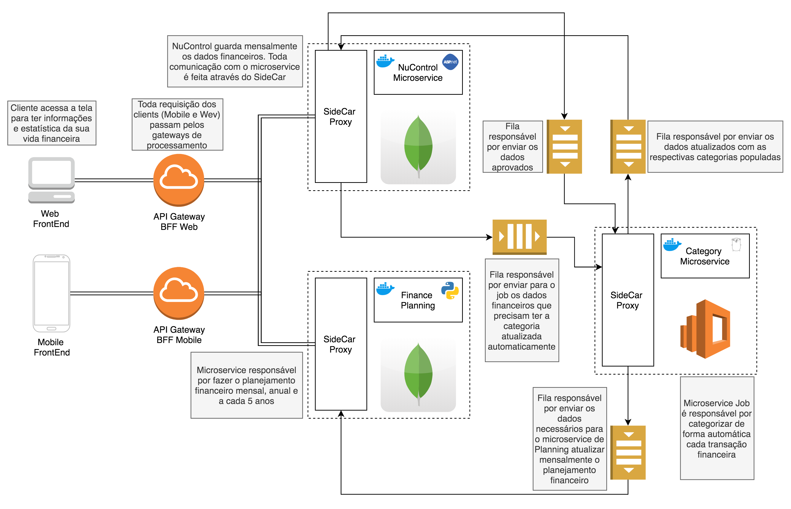

# Nu Finance Controll

Esse projeto é uma prova de conceito que pode ser usada em produção mas a princípio visa ser um caso de uso para um estudo de microsserivços contruidos em python, .net core e golang.

## Resume

Se você acessar a plataforma web do seu cartão de crédito, vai ser possível baixar um documento csv da sua ultima fatura contento as informações das suas transações bancárias.
Para cada transação existe a inforamção de data, cateogria, título e valor. Porém, as suas categorias criadas pelo aplicativo não aparecem nesse documento.

A idéia é uma plataforma que use essas informações para fazer o seu planjemanto financeiro mensal e anual. Te ajude com gráficos sobre quais lugares estão sendo mais gastos o seu dinheiro e outras análises estatísticas que estão para ser definidas.

Para isso você irá baixar o arquivo csv de suas faturas e através do front end, inputarada o arquivo para que seja gerado todas as análises em tempo real. As análises levarão em conta suas categorias criadas no aplicativo, então precisará ser imputado as suas categorias manualmente, porém, conforme a base de dados estiver crescendo o programa vai dar sujestões automáticamente sobre qual categoria deve pertencer cada transação.

## Initial POC

Por enquanto esta sendo criado o microsserviço que fará automaticamente as sujestões de categoria.

Através de uma fila de mensageria (Kafka), ele fará a leitura de uma registro financeiro e comparará com os registros financeiros antigos. Aqueles registros que tiverem a maior porcentagem de semelhança e de quantidade com o registro lido terá a sua categoria pessoal sujerida.

### Testando POC

O Microsserviço de Categorias está desnevolvido em GoLang. Ele faz integração com uma base de dados no ElasticSearch onde fica registrado todas as transições financeiras.

O Serivço por enquanto consome um tópico chamado "create-category-service" de um kafka.

Para subir a infraestrutura com o Kafka e o ElasticSearch usamos o docker-compose da raiz do projeto com o seguinte comando:

```bash
~/nubank-control $ docker-compose up -d
```

Para criar o tópico no Kafka, executar os seguinte comando na raiz do projeto:

```bash
~/nubank-control $ docker-compose exec kafka kafka-topics --create --if-not-exists --zookeeper zookeeper:2181 --partitions 1 --replication-factor 1 --topic create-cartegory-topic

```

Antes de subirmos a aplicação em Go, precisamos carregar nossa base de dados para podermos testar a eficácia do algorimito de sugestão de categoria. Para isso usamos um arquivo chamado bulk.json que está na raiz do projeto. Fazemos um POST HTTP para a nossa base de dados do ElasticSearch com esse arquivo e assim nós alimentamos a base com mais de 700 registros. Para fazer o POST realizamos o seguinte comando na raiz do projeto:

```bash
curl -i -X POST localhost:9200/registries_index/registry/_bulk -H "Content-Type: application/json" --data-binary "@resources/static/bulk.json"
```

Para validar quantos registros foram criados usamos o comando:

```bash
curl http://localhost:9200/_cat/indices\?v
```

E, se tudo estiver correto, obteremos a resposta abaixo:

```bash
health status index            uuid                   pri rep docs.count docs.deleted store.size pri.store.size
yellow open   registries_index zQV3dA8lTlel8Dt8KQGSDA   1   1        734            0     93.7kb         93.7kb
```

O próximo passo é subir a aplicação em Go. O projeto tem algumas depêndencias que devem ser instaladas antes de se aplicar o build.
Para instalar as dependências, executar os seguintes comandos:

```bash
~/nubank-control $ go get "github.com/yudai/golcs" # lib para algorítmo de lcs
~/nubank-control $ go get "github.com/gorilla/mux" # framework para expor api REST
~/nubank-control $ go get "gopkg.in/confluentinc/confluent-kafka-go.v1/kafka" # Kafka*
~/nubank-control $ go get "github.com/vladimirvivien/automi" # lib para fazer stream de dados

```

Para subir a aplicação, fazemos os seguintes comandos:

```bash
~/nubank-control $ cd category_service/
~/nubank-control/category_service $ go build
~/nubank-control/category_service $ ./category_service
```

O log da aplicação deve estar da seguinte forma:

```bash
Startup Service...
Start Consuming...
```

Para testarmos inicialmente, precisamos gerar uma mensagem no Kafka manualmente. Podemos usar um comando pelo terminal para enviarmos a mesnagem. A mensagem deve ser um json contendo as informações de um registro financeiro no seguinte formato:

```json
{
  "date": "2020-05-18",
  "category": "casa",
  "title": "Assaí Atacadista",
  "amount": 10
}
```

Para enviarmos a mensagem do exemplo em json acima, executamos o seguinte comando via terminal:

```bash
~/nubank-control $ docker-compose exec kafka bash -c "echo '{\"date\":\"2020-05-18\",\"category\":\"casa\",\"title\":\"Assaí Atacadis\",\"amount\":10}' | kafka-console-producer --request-required-acks 1 --broker-list kafka:29092 --topic create-cartegory-topic && echo 'Send Registry to Kafka...'"
```

O log então deve retornar da seguinte maneira:

```bash
Startup Service...
Start Consuming...
going repository with result size: 0
Registry Date: 2020-05-18 00:00:00 +0000 UTC
Registry Title: Assaí Atacadis
Registry Category: casa
Registry My Category: Despesa

#no caso, como não temos nenhum registro no banco, esse campo retornará vazio, mas experimente criar um registro que o campo my_category tenha esse valor, e o campo title tenha, no mínimo, 80% de semelhança com o title da mensagem em json. O valor retornara populado com a mesma categoria.
```

## Arquitetura Final do projeto

Por enquanto estamos no primeiro passo para o nosso projeto, porém a arquitetura já está bem definida para o que realmente querermos transformar o projeto. Abaixo segue o desenho da Arquitetura de como o projeto deve ficar no futuro.

<p align="center">
    
</p>  